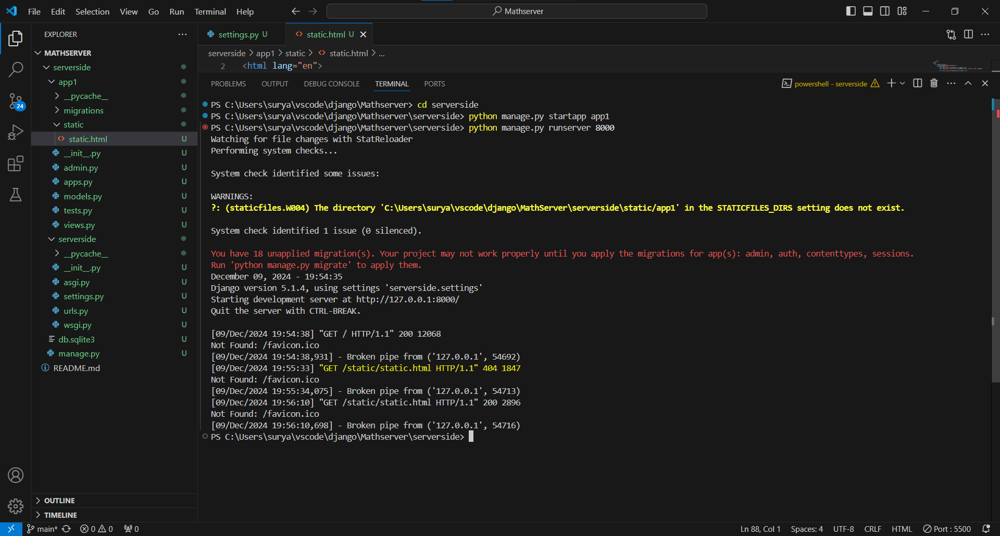
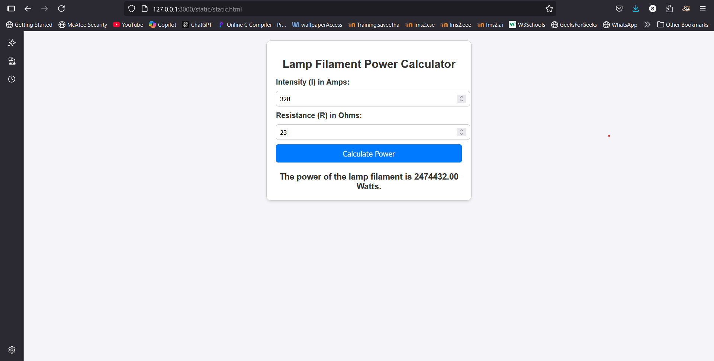

# Ex.05 Design a Website for Server Side Processing
## Date:08/12/2024

## AIM:
 To design a website to calculate the power of a lamp filament in an incandescent bulb in the server side. 


## FORMULA:
P = I<sup>2</sup>R
<br> P --> Power (in watts)
<br> I --> Intensity
<br> R --> Resistance

## DESIGN STEPS:

### Step 1:
Clone the repository from GitHub.

### Step 2:
Create Django Admin project.

### Step 3:
Create a New App under the Django Admin project.

### Step 4:
Create python programs for views and urls to perform server side processing.

### Step 5:
Create a HTML file to implement form based input and output.

### Step 6:
Publish the website in the given URL.

## PROGRAM :
```
<!DOCTYPE html>
<html lang="en">
<head>
    <meta charset="UTF-8">
    <meta name="viewport" content="width=device-width, initial-scale=1.0">
    <title>Lamp Filament Power Calculator</title>
    <script>
        function calculatePower() {
            const intensity = parseFloat(document.getElementById('intensity').value);
            const resistance = parseFloat(document.getElementById('resistance').value);

            if (isNaN(intensity) || isNaN(resistance) || intensity <= 0 || resistance <= 0) {
                document.getElementById('result').textContent = "Please enter valid positive values for both intensity and resistance.";
                return;
            }

            const power = Math.pow(intensity, 2) * resistance; // P = I^2 * R
            document.getElementById('result').textContent = `The power of the lamp filament is ${power.toFixed(2)} Watts.`;
        }
    </script>
    <style>
        body {
            font-family: Arial, sans-serif;
            margin: 20px;
            background-color: #f4f4f9;
            color: #333;
        }
        .container {
            max-width: 400px;
            margin: 0 auto;
            padding: 20px;
            border: 1px solid #ccc;
            border-radius: 10px;
            background-color: #fff;
            box-shadow: 0 2px 4px rgba(0, 0, 0, 0.1);
        }
        h1 {
            text-align: center;
            font-size: 24px;
        }
        label {
            font-weight: bold;
        }
        input[type="number"] {
            width: 100%;
            padding: 8px;
            margin: 10px 0;
            border: 1px solid #ccc;
            border-radius: 5px;
        }
        button {
            width: 100%;
            padding: 10px;
            background-color: #007BFF;
            color: white;
            border: none;
            border-radius: 5px;
            cursor: pointer;
            font-size: 16px;
        }
        button:hover {
            background-color: #0056b3;
        }
        .result {
            margin-top: 20px;
            font-size: 18px;
            font-weight: bold;
            text-align: center;
        }
    </style>
</head>
<body>
    <div class="container">
        <h1>Lamp Filament Power Calculator</h1>
        <form id="powerForm">
            <label for="intensity">Intensity (I) in Amps:</label>
            <input type="number" id="intensity" placeholder="Enter intensity in Amps" required>

            <label for="resistance">Resistance (R) in Ohms:</label>
            <input type="number" id="resistance" placeholder="Enter resistance in Ohms" required>

            <button type="button" onclick="calculatePower()">Calculate Power</button>
        </form>
        <div class="result" id="result"></div>
    </div>
</body>
</html>


```

## SERVER SIDE PROCESSING:


## HOMEPAGE:


## RESULT:
The program for performing server side processing is completed successfully.
